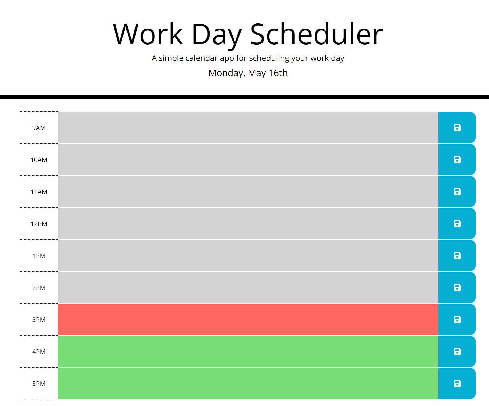

## Work-Day-Scheduler

## Description

This project was created to allow an employee with a busy schedule to manage their time effectively by adding events to a dynamic daily planner. The requirements for this project were as follows:
* When the planner site is visited, the current day is displayed at the top of the page.
* When the user scrolls down, the time blocks are shown from 9AM to 5PM (the standard business hours).
* When the user views the time blocks, they are color coded to show that the time is past, present, or future.
* When the user clicks in each time block, they can enter an event via text.
* When the user clicks the save button for that time block, the text is saved in local storage.
* When the user refreshes the page, the events remain/are loaded from local storage.

## Table of Contents (Optional)
- [Installation](#installation)
- [Links](#links)
- [Usage](#usage)
- [Creation](#creation)
- [License](#license)

## Installation
The repository, Work-Day-Scheduler, was created locally and initialized to GitHub. It utilized a boilerplate HTML skeleton and previously-coded styling blocks from another repository, super-disco. The index.html file was copied and pasted into the repository and further coded. The assets folder contains three other folders: css, images, and js. The css folder contains the previously-coded style.css file with some changes. The images folder contains a screenshot of the site. The js folder contains a created script.js file that allows the site to be dynamic.

## Links
- [GitHub Repository](https://github.com/amklenk/Work-Day-Scheduler)
- [GitHub Pages Site](https://amklenk.github.io/Work-Day-Scheduler/)

## Usage

Below is a screenshot of the live site:

The site is utilized by entering text in each text area and clicking each corresponding save button to save the text to local storage. Upon refreshing the page, the user should be able to have their text retrieved from local storage. The colors that designate past, present, and future should update as the time updates.

## Creation
Each of the requirements were fulfilled:
* When the planner site is visited, the current day is displayed at the top of the page.
* When the user scrolls down, the time blocks are shown from 9AM to 5PM (the standard business hours).
* When the user views the time blocks, they are color coded to show that the time is past, present, or future.
* When the user clicks in each time block, they can enter an event via text.
* When the user clicks the save button for that time block, the text is saved in local storage.
* When the user refreshes the page, the events remain/are loaded from local storage.

First, the html file was inspected and run, along with an inspection of the css file, to see how the site initially functioned and was styled. The index.html was further coded to create the rows, columns, and the hour designation and disk icons in the first and third columns of each row, respectively. The CSS classes that corresponded to each row, column, button, etc. were then added to utilize the unaltered styling blocks.

The CSS file was further coded to add detailed formatting and styling. The additional styling blocks (and additions to the original styling blocks) format the moment current date display, center the textarea precisely, format the disk icon, add a dotted line at the bottom of the time block of the last row. The style sheet is organized by element, class, and then id selectors. Within each selector type, the blocks are organized by the way the HTML code flows.

The JS file was coded with pseudocode to outline the site's needed funcitonality and ideas for what kinds of code that funtionality would need. The global variable and setDate functions were coded first to make sure moment.js was properly scripted in the HTML file and to append the current date to the page. The setRow function was coded next to dynamically add and remove classes depending on the hour, determined using moment.js. The file originally had separate functions for each row that saved and loaded the text from the textareas to and from local storage with a separate event listener for each row. The final refactor utilized jQuery's this selector and methods (such as parent, siblings, children, attr, and split) to target each button and text area with an event listener to perform the same functionality. The functions are called the botton of the page.

## License

MIT License

Copyright (c) [2022] [Amanda Klenk]

Permission is hereby granted, free of charge, to any person obtaining a copy
of this software and associated documentation files (the "Software"), to deal
in the Software without restriction, including without limitation the rights
to use, copy, modify, merge, publish, distribute, sublicense, and/or sell
copies of the Software, and to permit persons to whom the Software is
furnished to do so, subject to the following conditions:

The above copyright notice and this permission notice shall be included in all
copies or substantial portions of the Software.

THE SOFTWARE IS PROVIDED "AS IS", WITHOUT WARRANTY OF ANY KIND, EXPRESS OR
IMPLIED, INCLUDING BUT NOT LIMITED TO THE WARRANTIES OF MERCHANTABILITY,
FITNESS FOR A PARTICULAR PURPOSE AND NONINFRINGEMENT. IN NO EVENT SHALL THE
AUTHORS OR COPYRIGHT HOLDERS BE LIABLE FOR ANY CLAIM, DAMAGES OR OTHER
LIABILITY, WHETHER IN AN ACTION OF CONTRACT, TORT OR OTHERWISE, ARISING FROM,
OUT OF OR IN CONNECTION WITH THE SOFTWARE OR THE USE OR OTHER DEALINGS IN THE
SOFTWARE.